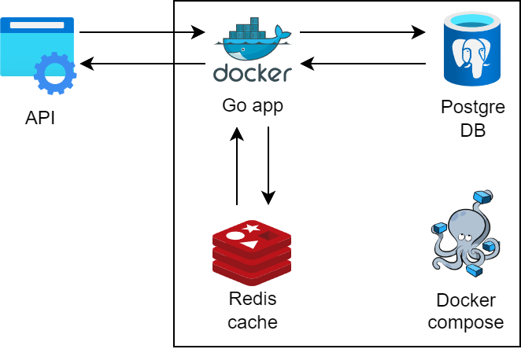
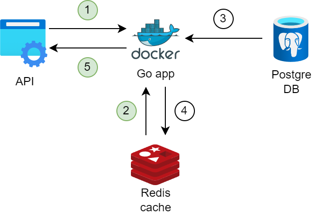

# Запуск

Заполнить файлы ```.env.example``` в [```docker/server```](./docker/server) и [```docker/tests```](./docker/tests) настройки к postgresql и redis
```
APP_PORT=       #Порт приложения
DB_USER=        #Имя пользователя
DB_PASSWORD=    #Пароль пользователя
DB_NAME=        #Имя базы данных
DB_PORT=        #Порт
DB_HOST=        #Имя хоста
CACHE_HOST=     #Хост кэша
CACHE_PORT=     #Порт кэша
CACHE_PASSWORD= #Пароль кэша
CACHE_TTL=      #Время жизни кэшируемых объектов
```
Переименовать их в ```.env```

### 1 вариант Docker
Нужен docker и docker-compose

Запустить:

```make docker``` - Соберет контейнер и запустит его

```make docker-test``` - Соберет среду для тестов и прогонит интеграционные тесты

### 2 вариант Локальный запуск

Запустить:

```make env``` - Экспортирует переменные окружения (не тестовые)

``` make run ``` - Соберет проект локально и запустит приложение (бд и кэш нужно запускать отдельно)

# Архитектура


* Docker - для контейнеризации сервиса
* PostgreSQL - в роли БД
* Redis - для кэширования частых запросов
* Docker compose - для управления несколькими контейнерами

# Вопросы и решения
### Как ускорить работу с бд
Решение: использовать кэширование данных в Redis, находится в памяти потому скорость работы с бд значительно выше
### Какой тип кэширования использовать
Тут есть несколько вариантов
#### Write Behind/Write through
* Write Behind - асинхронная запись в бд, не постоянная синхронизация с бд, но быстро
* Write through - синхронная запись в бд при каждом запросе, медленнее но надежнее

Плюсы: быстрый доступ ко всем данным, доступ всегда к последней информации

Минусы: вся информация находится в оперативной памяти, что может быть достаточно затратно

#### Сache prefetching
* Сache prefetching - предзагрузка данных из бд, можно загружать основываясь на часто используемые запросы, паттерны запросов

Плюсы: также быстрый доступ ко всем данным и всегда последняя информация, можно использовать сложные запросы к данным

Минусы: для ускорения вся информация должна быть предзагружена в кэш

#### Cache-aside
* Cache-aside - обычная работа с бд, загрузка частых запросов в кэш

Плюсы: оптимальное кэширование, загрузка данных только по необходимости, при повторном запросе скорость получения данных увеличивается т.к. уже есть в кэше

Минусы: запись идет в бд, а не кэш, данные могут быть устаревшими, но в нашем случае это подходит

Решение: т.к. на чтение будет происходить большинство запросов от пользователей и количество баннеров может быть большим, то выбор пал на Cache-aside. Разработчик может подождать, пользователь нет :)



При первичном запросе будут выполнены шаги
1) Запрос к сервису
2) Поиск ответа на запрос в кэше
3) Получение данных из бд
4) Ассинхронная запись в кэш
5) Ответ на запрос

Однако при следующем запуске будут выполнены только шаги 1,2,5. Это сильно ускоряет время ответа на запрос

# Линтер

Для запуска линтера есть команды в make

```make .install-linter``` - скачает golangci-lint

```make lint``` - скачивает и запускает линтер с конфигурацией из файла

```make lint-fast``` - скачивает и запускает линтер в быстром режиме (пропускает тяжеловесные линтеры)

# Makefile

Все команды

#### Локальная работа
```make build``` - собирает проект

```make test``` - запускает тесты

```make tidy``` - очищает неиспользуемые зависимости

```make run``` - запускает проект после сборки

```make clean``` - очищает собранный проект

```make all``` - выполняет тесты и собирает проект

#### Работа с Docker
```make docker``` - запускает проект в Docker

```make docker-clear``` - останавливает и удаляет контейнеры Docker

```make docker-rebuild``` - пересобирает и запускает проект в Docker

```make docker-test``` - запускает тесты в Docker

```make docker-test-clear``` - останавливает и удаляет контейнеры тестов в Docker
#### Работа с линтером
```make .install-linter``` - устанавливает linter

```make lint``` - запускает linter

```make lint-fast``` - запускает linter пропуская тяжеловесные проверки
#### Работа с окружением
```make env``` - устанавливает переменные окружения из файла docker/server/.env
